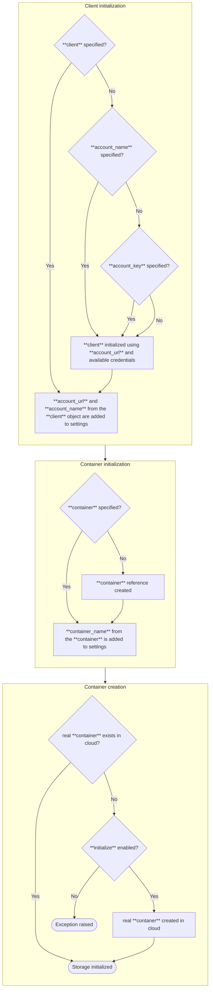

# Azure Blob Storage

The `file_keeper:azure_blob` adapter allows you to use [Microsoft Azure Blob
Storage](https://azure.microsoft.com/en-us/products/storage/blobs) for storing
and retrieving files. This adapter leverages the `azure-storage-blob` Python
library.

## Overview

This adapter provides a convenient way to integrate Azure Blob Storage with
file-keeper. You'll need to have the `azure-storage-blob` library installed and
configure it with the appropriate credentials for your Azure account.

```sh
pip install 'file-keeper[azure]'

## or

pip install azure-storage-blob
```


## Initialization

/// details | Flow



///

Here's an example of how to initialize the Azure Blob Storage adapter:


/// tab | Azure Blob Storage

```py
storage = make_storage("my_azure_storage", {
    "type": "file_keeper:azure_blob",
    "account_name": "***",
    "account_key": "***",
    "container_name": "file-keeper",
    "initialize": True,
})

```

///

/// tab | Azurite

```python
storage = make_storage("my_azure_storage", {
    "type": "file_keeper:azure_blob",
    "account_name": "devstoreaccount1",
    "account_key": "Eby8vdM02xNOcqFlqUwJPLlmEtlCDXJ1OUzFT50uSRZ6IFsuFq2UVErCz4I6tq/K1SZFPTOtr/KBHBeksoGMGw==",
    "container_name": "file-keeper",
    "initialize": True,
    "account_url": "http://127.0.0.1:10000/{account_name}",
})

```

///

## Important Notes

*   Replace the placeholder values with your actual Azure account credentials
    and configuration.
*   Ensure that you have created a container in your Azure Blob Storage account
    to store the files.
*   For enhanced security, consider using Azure Active Directory (Azure AD)
    authentication instead of account keys.  Refer to the `azure-storage-blob`
    documentation for details on Azure AD authentication.
*   Refer to the [Azure Blob Storage
    documentation](https://learn.microsoft.com/en-us/azure/storage/blobs/index)
    for more information about Azure Blob Storage.
