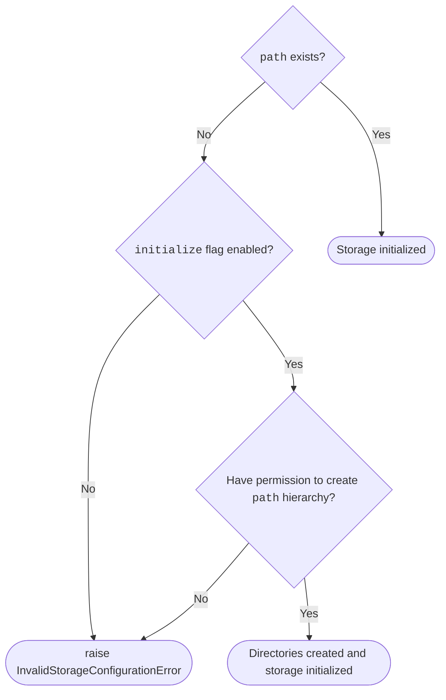

# Local filesystem

`file_keeper:fs`

No specific settings.

If directory specified by `path` option does not exists, depending on
`initialize` flag, storage will make an attempt to create `path` or rise
[InvalidStorageConfigurationError][file_keeper.exc.InvalidStorageConfigurationError].

/// details | Storage initialization

///

/// admonition
    type: example

```py
storage = make_storage("sandbox", {
    "type": "file_keeper:fs",
    "path": "/tmp/file-keeper",
    "initialize": True,
})
```
///
